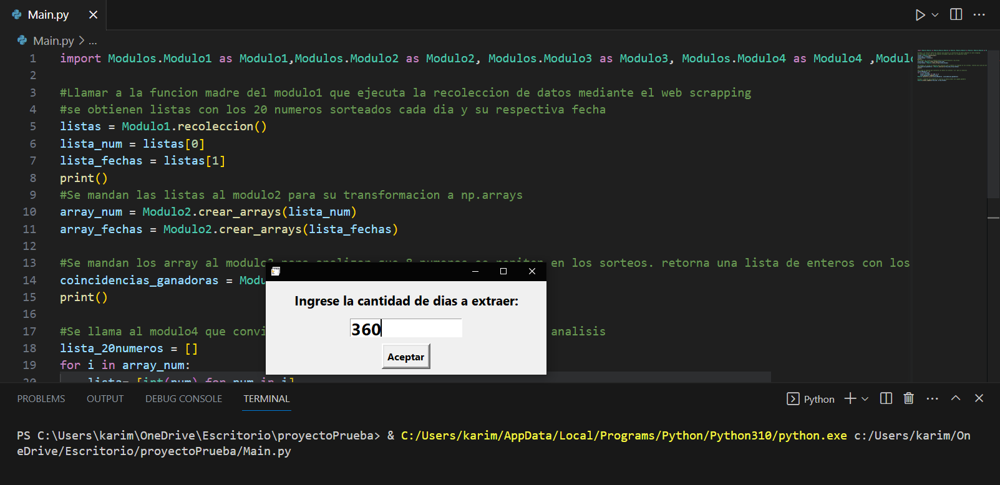
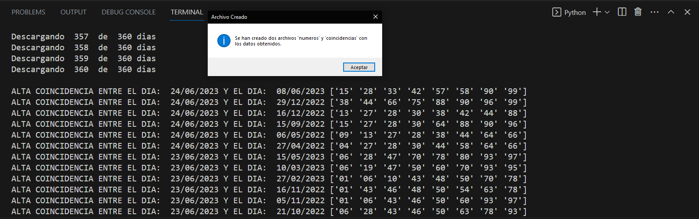
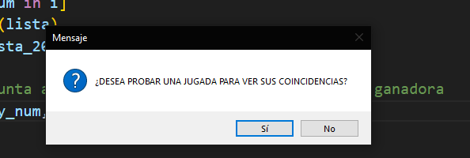

# 🎰 Proyecto evaluativo - Procesamiento de Datos
- Proyecto evaluativo para la materia Procesamiento de Datos de la tecnicatura superior en Ciencia de Datos e Inteligencia Artificial - Instituto Superior Politécnico Córdoba

## 👨‍💻 Integrantes:
- Marcelo Karim Juri Garay

## 🎯 Objetivo de este proyecto:
Conseguir a través de la recolección, procesamiento y análisis, una guía para ver qué números pueden convertirte en millonario🤑

## ❓ Descripción del proyecto:
Proyecto que gira en torno a uno de los juegos de la Lotería de Córdoba llamado "Poceada Cordobesa". Se trata de un juego que toma los 20 (veinte) números del extracto de Quiniela de Córdoba (nocturno) en sus dos últimos dígitos (unidad y decena). Para jugar a la Poceada Cordobesa, el apostador deberá elegir 8 (ocho) números de dos dígitos, distintos entre sí, del 00 al 99. Si los números elegidos están dentro de los 20 números del extracto del sorteo nocturno de la Quiniela de Córdoba, sin importar el orden, ¡obtendrá un premio!
Ganará a la Poceada Cordobesa, quien acierte 5, 6, 7 u 8 números.

A través de la técnica Web Scraping se recolectan los 20 números sorteados en los últimos 365 días (el usuario que ejecuta el código puede extraer tantos días como desee).

Luego se limpian los datos obtenidos, se los prepara, procesa y se analizan.

La idea principal del código es comparar cada extracto (20 números sorteados) con los demás extraídos, encontrando así combinaciones de 8 números que se repitan en diferentes sorteos, para que eso nos guíe a la hora de apostar y hacer "una jugada ganadora".

El código también permite que el usuario ingrese una combinación de 8 números y los compara con los 20 números sorteados para ver si hubiera ganado al haber apostado diariamente en un periodo relativamente corto.

Una vez hecho el análisis, el código crea dos archivos .csv: uno llamado "Números.csv", que contiene todos los números sorteados, y el otro llamado "Coincidencias.csv", que contiene las coincidencias de 8 números ganadores que se han encontrado en diferentes sorteos de manera repetida.

Por último, con esos dos archivos se procede a realizar una visualización de datos en un Jupyter Notebook para mostrar los resultados obtenidos.

## 📥 Instrucciones para ponerlo en marcha:
- Descargue el archivo ZIP o clone el repositorio en su computadora local.
- Realice la instalación de las librerías pertinentes. Ejecute CMD como administrador y luego:
'Pip install requests bs4 pandas beautifulsoup4 urljoin numpy re tkinter'
- Ejecute el archivo llamado Main.py
- Cuando termine, además de ver los resultados en la consola, puede ejecutar el Jupyter notebook y ver los resultados graficados y ordenados.

## ⚠️ Reportes y sugerencias
Si el programa presenta algún error que debería ser reportado para arreglarlo, si podría haber alguna nueva funcionalidad para agregar al programa, o si algo podría ser modificado, puedes hablarlo conmigo personalmente mediante correo electrónico a karim.dev.tech@gmail.com.

## 📸 Capturas de pantalla
*Cuando ejecute el archivo 'Main.py' le aparecerá esto*

*Una vez ingresados los días, comenzará la recolección de datos*

*Una vez terminado, le aparecerá por consola las coincidencias ganadoras*

*Se crean automáticamente los archivos '.csv'*

*El programa le preguntará si quiere intentar una jugada, si pone 'Si' se ejecuta, si pone 'No' termina el programa.*

*Suponiendo que puso 'Si', puede probar tantas jugadas como desee*

