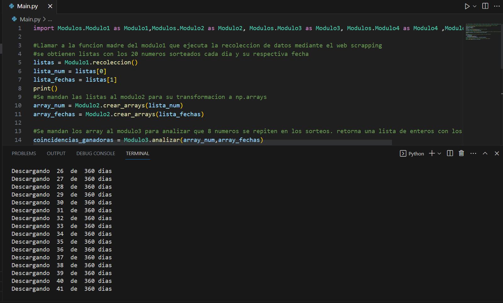
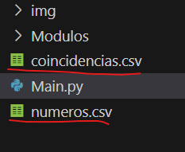

# 🎰 Proyecto evaluativo final - Procesamiento de Datos

## 👨‍💻 Integrantes:
- Marcelo Karim Juri Garay

## 🎯 Objetivo de este proyecto:
Conseguir a traves de la recolección, procesamiento y analisis, una guia para ver que numeros pueden convertirte en millonario🤑

## ❓ Descripción del proyecto:
Proyecto que gira en torno a uno de los juegos de la Loteria de Córdoba llamado "Poceada Cordobesa". Se trata de un juego que toma los 20 (veinte) números del extracto de Quiniela de Córdoba (nocturno) en sus dos últimos dígitos (unidad y decena).Para jugar a la Poceada Cordobesa, el apostador deberá elegir 8 (ocho) números de dos dígitos, distintos entre si, del 00 al 99. Si los números elegidos están dentro de los 20 números del extracto del sorteo nocturno de la Quiniela de Córdoba, sin importar el orden, obtendrá un premio!
Ganará a la Poceada Cordobesa, quien acierte 5, 6, 7 u 8 números!

A traves de la tecnica Web Scrapping se recolectan los 20 números sorteados los ultimos 365 dias (el usuario que ejecuta el codigo puede extrar tantos dias como desee).

Luego se limpian los datos obtenidos, se los prepara, procesa, y se analizan.

La idea principal del codigo es comparar cada extracto (20 numeros sorteados) con los demas extraidos, encontrando asi combinaciones de 8 números que se repitan en diferentes sorteos, para que eso nos guie a la hora de apostar y hacer "una jugada gandora".

El código tambien permite que el usuario ingrese una combinancion de 8 numeros y los compara con todos los 20 numeros sorteados para ver si hubiera ganado de haber apostado diariamente en un periodo relativamente corto.

Una vez hecho el analisis el código crea dos archivos .csv, uno llamado "Números.csv" el cual contiene todos los numeros sorteados, y el otro llamado "Coincidencias.csv" el cual contiene las coincidencias de 8 números ganadores que se han encontrado en diferentes sorteos de manera repetida.

Por ultimo, con esos dos archivos se procede a realizar una visualizacion de datos en un Jupyter Notebook para mostrar los resultados obtenidos.

## 📥 Instrucciones para ponerlo en marcha:
- Descarge el archivo ZIP o clone el repositorio en su computador local.
- Realice la instalacion de las librerias pertinentes. Ejecute CMD como administrador y luego:
'Pip install requests bs4 pandas beautifulsoup4 urljoin numpy re tkinter'
- Ejecute el archivo llamado Main.py
- Cuando termine ademas de ver los resultados en la consola puede ejecutar el Jupyter notebook y ver los resultados graficados y ordenados

## ⚠️ Reportes y sugerencias
Si el programa presenta algún error que debería ser reportado para arreglarlo, si podría haber alguna nueva funcionalidad para agregar al programa, o si algo podría ser modificado, puedes hablarlo conmigo personalmente mediante mail karim.dev.tech@gmail.com

## 📸 Capturas de pantalla
*Cuando ejecute el archivo 'Main.py' le aparecera esto*

*Una vez ingrersados los días comenzara la recolección de datos*

*Una vez terminado le aparecerá por consola las coincidencias ganadoras*

*Se crean automaticamente los archivos '.csv'*

*El programa le preguntara si quiere intentar una jugada, si pone 'Si' se ejecuta, si pone 'No' termina el programa.* 

*Suponiendo que puso 'Si', puede probar tantas jugadas como desee* 

